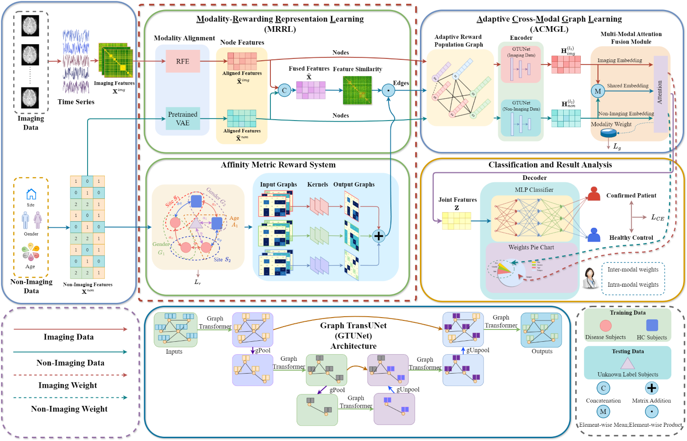

# MM-GTUNets




## Contents
0. [Installation](#installation)
0. [Configuration](#configurationn)
0. [Data](#data)
0. [Training](#train)
0. [Testing](#testing)


## Installation
Code developed and tested in Python 3.9.0 using PyTorch 2.0.0. Please refer to their official websites for installation and setup.

Some major requirements are given below:

```python
numpy~=1.26.2
networkx~=2.7.1
torch~=1.10.0
scikit-learn~=1.2.2
scipy~=1.10.1
matplotlib~=3.5.0
torch-cluster~=1.6.0
torch-geometric~=2.0.4
torch-scatter~=2.0.9
torch-sparse~=0.6.13
torch-spline-conv~=1.2.1
networkx~=2.8.8
nibabel~=5.1.0
nilearn~=0.10.1
tensorboard~=2.13.0
tensorboard-data-server~=0.7.1
tensorboardX~=2.6
```


## Configuration

Please see Configs >>>[here](./opt.py/) Lines 44-96<<<.

| Configs    | Custom key                          | note              |
|------------|-------------------------------------|-------------------|
| dataset    | ABIDE/ADHD-200                      | dataset           |
| seed       | random seeds                        | default is 911    |
| train      | train or test (int)                 | 1-train, 0-test   |
| fold       | 10 (int)                            | k-fold validation |
| early_stop | early stop patience (int)           | default is 100    |
| lr         | initial model learning rate (float) | default is 1e-4   |
| vae_lr     | initial vae learning rate (float)   | default is 1e-3   |
| epoch      | number of epochs for training (int) | default is 500    |

other args:
* `--node_dim` dimension of node features after modality alignment
* `--img_depth` depth of the img_unet
* `--ph_depth` depth of the ph_unet
* `--hidden` hidden channels of the unet
* `--out` out channels of the unet
* `--dropout` ratio of dropout
* `--edge_drop` ratio of edge dropout
* `--pool_ratios` pooling ratio to be used in the Graph_Unet
* `--smh` graph_loss_smooth
* `--deg` graph_loss_degree
* `--val` graph_loss_value


## Data
### ABIDE
To fetch ABIDE public datasets.
```shell
python fetch_abide.py
```

### ADHD-200
The pre-processed ADHD-200 data upload address is as follows:

#### Google Drive

Link：https://drive.google.com/drive/folders/19HoajzuBFIV0dVGLtWv_jx2c0qg9srX_?usp=sharing 


#### Baidu Cloud Drive

Link：https://pan.baidu.com/s/16sqz0fZvuSHHypMkLtikbA 

Password：qj12

## Training

Classification Task ( Default dataset is ABIDE )
```shell
python train_mm_gtunets.py --train 1
```

## Testing

Classification Task ( Default dataset is ABIDE ) 
```shell
python train_mm_gtunets.py --train 0
```
